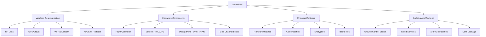
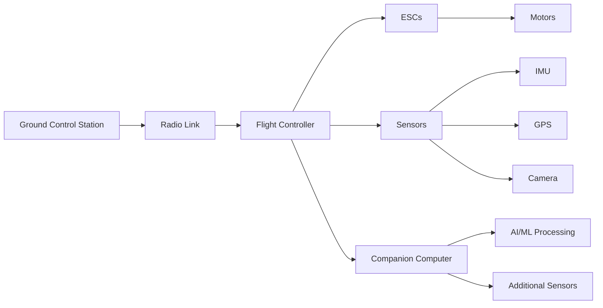
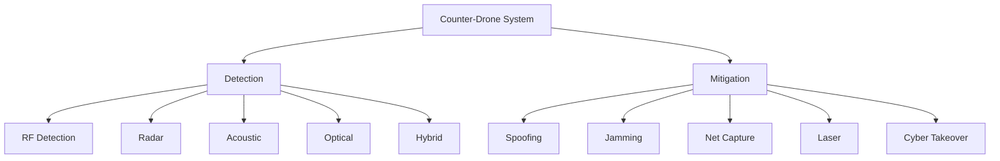

# 🚁 DroneSec-Resources

<div align="center">


*A comprehensive collection of resources for learning and mastering drone/UAV security, with a strong focus on offensive security techniques including firmware analysis, radio protocols, side-channel attacks, electromagnetic (EM) analysis, and exploitation.*

[](https://awesome.re)
[](https://opensource.org/licenses/MIT)
[](https://github.com/seedon198/DroneSec-Resources)
[](https://github.com/seedon198/DroneSec-Resources)

</div>

---

## 📋 Table of Contents

- [🎯 Introduction](#-introduction)
- [🚀 Getting Started](#-getting-started)
- [📚 Learning Path](#-learning-path)
- [🔒 Core Topics](#-core-topics)
- [🛠️ Tools & Frameworks](#️-tools--frameworks)
- [📄 Research Papers & Conference Talks](#-research-papers--conference-talks)
- [🎓 Training & Certifications](#-training--certifications)
- [📖 Books & Guides](#-books--guides)
- [🎮 CTFs & Practice Labs](#-ctfs--practice-labs)
- [👥 Community & Resources](#-community--resources)
- [⚖️ Legal & Ethical Considerations](#️-legal--ethical-considerations)
- [🔬 Advanced Topics](#-advanced-topics)
- [📊 Vulnerability Database](#-vulnerability-database)
- [🧪 Lab Exercises](#-lab-exercises)
- [📺 Video Resources](#-video-resources)
- [🔧 Hardware Recommendations](#-hardware-recommendations)
- [🤝 Contributing](#-contributing)
- [📜 Disclaimer](#-disclaimer)
- [📚 References](#-references)

---

## 🎯 Introduction

This repository is a curated, comprehensive collection of resources for security researchers, penetration testers, and enthusiasts interested in **drone/UAV security**. The emphasis is on **offensive security techniques** to understand, exploit, and mitigate vulnerabilities in unmanned aerial systems (UAS).

### Why Drone Security?

<div align="center">

| **Rapid Growth** | **Critical Infrastructure** | **Emerging Threats** | **Vulnerability Surface** |
|:---:|:---:|:---:|:---:|
| 1.1M+ drones in US | Military, Law Enforcement | 350+ incursions (2024) | RF, GPS, Firmware, EM |
| $43B market by 2025 | Commercial, Civilian | Urban Air Mobility | Wi-Fi, Bluetooth, MAVLink |

</div>

### Attack Surfaces Overview



---

## 🚀 Getting Started

### Prerequisites

**Essential Knowledge:**
- Basic electronics and embedded systems
- Wireless protocols (Wi-Fi, Bluetooth, RF)
- Linux/Unix command line
- Python/C++ programming
- Networking fundamentals

**Hardware Setup (Optional but Recommended):**

| Component | Entry Level | Intermediate | Professional |
|-----------|-------------|--------------|--------------|
| **Test Drone** | DJI Tello ($100) | Parrot Bebop 2 ($200) | DJI Mavic 3 ($1500+) |
| **SDR** | RTL-SDR ($30) | HackRF One ($300) | USRP ($1000+) |
| **Wi-Fi** | Alfa AWUS036ACH ($50) | Wi-Fi Pineapple ($100) | Professional gear |
| **Analysis** | Laptop + Software | Logic Analyzer ($50) | ChipWhisperer ($1500) |

### Quick Start Guide

1. **Start with Fundamentals** (1-2 weeks)
   - [Drone Security Fundamentals](https://training.dronesec.com/p/fundamentals) - Free course
   - [A Beginner's Guide to Understanding Drones](https://medium.com/@sukantkhurana/a-beginners-guide-to-drones-38d215701c4e)

2. **Set up Virtual Environment** (1 week)
   - ArduPilot SITL (Software In The Loop)
   - [Damn Vulnerable Drone](https://github.com/nicholasaleks/Damn-Vulnerable-Drone)

3. **Practice with Tools** (2-4 weeks)
   - Wireshark for packet analysis
   - GNU Radio for SDR
   - Ghidra for reverse engineering

---

## 📚 Learning Path

### Phase 1: Foundation (Weeks 1-4)
**Focus:** Understanding drone architecture and basic security concepts

- ✅ Drone components and communication protocols
- ✅ MAVLink protocol basics
- ✅ Wireless security fundamentals
- ✅ Virtual testing environment setup

**Resources:**
- [Complete Drone Security Bundle](https://training.dronesec.com/p/bundle) - Comprehensive training
- [ArduPilot Documentation](https://ardupilot.org/dev/)
- [MAVLink Developer Guide](https://mavlink.io/en/)

### Phase 2: Core Skills (Weeks 5-12)
**Focus:** Hands-on attack techniques and analysis

- ✅ Wireless attacks (deauth, MITM)
- ✅ GPS vulnerabilities and spoofing
- ✅ Protocol analysis and fuzzing
- ✅ Firmware extraction and analysis

**Resources:**
- [Drone Security and Countermeasures Training](https://niccs.cisa.gov/training/catalog/tonex/drone-security-and-countermeasures-training) - CISA/NICCS
- [Class Central Drone Security Courses](https://www.classcentral.com/subject/drone-security)

### Phase 3: Advanced Techniques (Weeks 13-24)
**Focus:** Reverse engineering and advanced exploitation

- ✅ ARM/MIPS firmware analysis
- ✅ SDR signal generation and analysis
- ✅ Advanced GPS spoofing techniques
- ✅ Exploit development

### Phase 4: Specialization (Weeks 25+)
**Focus:** Research and specialization

- ✅ Side-channel attacks (power/EM analysis)
- ✅ RF exploitation and protocol reversing
- ✅ Original research and bug bounties
- ✅ Conference presentations and publications

---

## 🔒 Core Topics

### Drone Architecture & Components



**Key Components:**
- **Flight Controller (FC):** ArduPilot, PX4, DJI proprietary
- **ESCs:** Electronic Speed Controllers for motor control
- **Sensors:** IMU, GPS, barometer, magnetometer
- **Communication:** MAVLink, DroneCAN, proprietary protocols

### Communication Protocols

| Protocol | Frequency | Security | Use Case |
|----------|-----------|----------|----------|
| **MAVLink** | Various | Basic (v1.0) / Signed (v2.0) | Standard drone communication |
| **Wi-Fi** | 2.4/5.8 GHz | WPA2/WPA3 | Video streaming, telemetry |
| **Bluetooth** | 2.4 GHz | BLE security | Mobile app control |
| **GPS** | 1.575 GHz | None (civilian) | Navigation |
| **DJI OcuSync** | 2.4/5.8 GHz | Proprietary | DJI drones |

### Attack Vectors

| **Wireless** | **Hardware** | **Firmware** | **Applications** |
|:---:|:---:|:---:|:---:|
| RF Jamming/Spoofing | Debug Port Access | Binary Analysis | Mobile App Vulnerabilities |
| GPS Manipulation | Side-Channel Attacks | Firmware Modification | Cloud Service Exploits |
| Protocol Hijacking | Hardware Trojans | Authentication Bypass | Network Infrastructure |

---

## 🛠️ Tools & Frameworks

### Penetration Testing Frameworks

| Tool | Description | GitHub | Use Case |
|------|-------------|--------|----------|
| **DroneSploit** | Metasploit-like framework for drone exploits | [Link](https://github.com/dhondta/dronesploit) | Automated exploitation |
| **Damn Vulnerable Drone** | Intentionally vulnerable UAV simulation | [Link](https://github.com/nicholasaleks/Damn-Vulnerable-Drone) | Learning environment |
| **Drone Hacking Tool** | GUI for Wi-Fi/GPS attacks | [Link](https://github.com/HKSSY/Drone-Hacking-Tool) | User-friendly interface |
| **Firmware Ninja** | UAV binary reverse engineering | [Binary Ninja](https://binary.ninja/2025/04/02/firmware-ninja.html) | Firmware analysis |
| **DRAT** | DJI Mavic assessment framework | ACM CICSYN 2020 | DJI vulnerability assessment |
| **FIMI A3 RE** | Firmware/camera reverse engineering | [GitHub](https://github.com/KonradIT/fimi_a3) | FIMI drone analysis |
| **RUB-SysSec/DroneSecurity** | Open-source frameworks for fuzzing drone protocols | [GitHub](https://github.com/RUB-SysSec/DroneSecurity) | Protocol fuzzing and DroneID decoding |
| **DJI-Firmware-Tools** | DJI firmware extraction and analysis | [GitHub](https://github.com/o-gs/dji-firmware-tools) | DJI firmware unpacking |

### Additional Offensive Tools

- **Dronesploit Analysis**: [DroneSec Blog](https://dronesec.com/blog/drone-hacking-tool-analysis-dronesploit)
- **Drone Operation and Demolition Guide**: [Medium Guide](https://medium.com/@redfanatic7/drone-operation-and-demolition-guide-444eebccbc0d)
- **Airspace Mapper**: Tool for tracing drone communications

### SDR Tools

**Hardware Recommendations:**

| SDR Device | Price | Frequency Range | TX/RX | Best For |
|------------|-------|-----------------|-------|----------|
| **RTL-SDR v3** | $30 | 24MHz - 1.7GHz | RX only | Beginners, monitoring |
| **HackRF One** | $300 | 1MHz - 6GHz | TX/RX | General purpose |
| **BladeRF 2.0** | $420 | 47MHz - 6GHz | TX/RX | Professional use |
| **USRP B200** | $1100 | 70MHz - 6GHz | TX/RX | Research, development |

**Software Stack:**
- **GNU Radio** - Signal processing framework
- **GQRX** - Spectrum analyzer
- **SDRangel** - Multi-purpose SDR application
- **URH** - Universal Radio Hacker

### Firmware Analysis Tools

```bash
# Firmware extraction
binwalk -e firmware.bin

# Static analysis
ghidra firmware.bin

# Dynamic analysis
qemu-system-arm -M versatilepb -kernel firmware.bin

# Protocol analysis
wireshark capture.pcap
```

---

## 📄 Research Papers & Conference Talks

### Comprehensive Resource Table

| Type | Title | Conference/Journal | Year | Focus | Links |
|------|-------|-------------------|------|-------|-------|
| **Conference Talk** | Drones Hijacking: Multi-Dimensional Attack Vectors | DEF CON 24 | 2016 | Architecture exploits | [Video](https://www.youtube.com/watch?v=R6RZ5KqSVcg) \| [Slides](https://media.defcon.org/DEF%2520CON%252024/DEF%2520CON%252024%2520presentations/DEF%2520CON%252024%2520-%2520Aaron-Luo-Drones-Hijacking-Multi-Dimensional-Attack-Vectors-And-Countermeasures-UPDATED.pdf) |
| **Conference Talk** | Practical Aerial Hacking & Surveillance | Black Hat/DEF CON | 2015 | RF interception | [Video](https://www.youtube.com/watch?v=knrvrR-B1ZI) |
| **Conference Talk** | Hacking Invisibly & Silently with Light & Sound | DEF CON 25 | 2017 | Non-RF side-channels | [Video](https://www.youtube.com/watch?v=gFTiD7EnVjU) |
| **Conference Talk** | Deep Dive: RE & Exploitation of Drones | RECON | 2023 | Firmware/PCB analysis | [Slides](https://mschloegel.me/slides/slides_recon23_drone_security.pdf) |
| **Conference Talk** | Running XBOW Live: Drone Pentesting | Black Hat/DEF CON | 2025 | Vulnerability scanning | [Blog/Slides](https://xbow.com/blog/black-hat-2025) |
| **Conference Talk** | Hacking a Professional Drone | Black Hat Asia | 2016 | Commercial UAV exploitation | Nils Rodday |
| **Conference Talk** | Grand Theft Drone – Breaking Drone RF Links | Black Hat USA | Various | Proprietary radio protocols | Multiple presentations |
| **Conference Talk** | Drone Attacks on Industrial Wireless | Black Hat USA | Various | Industrial wireless vulnerabilities | Multiple presentations |
| **Conference Talk** | SkyJack: Autonomous Drone Hacking | DEF CON 21 | 2013 | Autonomous hijacking | Samy Kamkar |
| **Conference Talk** | Maldrone: First Malware for Drones | DEF CON 23 | 2015 | First drone malware | Rahul Sasi |
| **Conference Talk** | DJI Drone Security: A Hacker's Perspective | 47C3 (CCC) | 2021 | Hardware analysis | DJI Mini-series compromise |
| **Research Paper** | Comprehensive Survey of Security/Privacy in UAV Systems | IEEE | 2025 | Hardware/software/comms attacks | [IEEE](https://ieeexplore.ieee.org/iel8/6287639/10820123/11053760.pdf) |
| **Research Paper** | Comprehensive Survey on Anti-UAV Methods | arXiv | 2025 | Detection/offensive benchmarking | [arXiv](https://arxiv.org/html/2504.11967v2) |
| **Research Paper** | Drone Cybersecurity Issues, Solutions, and Trends | ACM | 2023 | Privacy dissection | [ACM](https://dl.acm.org/doi/10.1007/s00521-023-08857-7) |
| **Research Paper** | Cyber4Drone: Systematic Review of Security & Forensics | MDPI | 2023 | Threat models/forensics | [MDPI](https://www.mdpi.com/2504-446X/7/7/430) |
| **Research Paper** | Secure UAV (Drone) and the Great Promise of AI | ACM CSUR | 2024 | AI/security roadmap | ACM CSUR |
| **Research Paper** | A Security Review in the UAVNet Era | ACM CSUR | 2022 | Threats/countermeasures | ACM CSUR |
| **Research Paper** | A Survey on Security and Privacy Issues of UAVs | ScienceDirect | 2023 | 4-level categorization | ScienceDirect |
| **Research Paper** | Surveying Cybersecurity Vulnerabilities... for UAVs | Comp Networks | 2024 | Auth/physical layer | Comp Networks |
| **Research Paper** | Security Vulnerabilities of UAVs... | IEEE | 2018 | DJI Phantom 4 Pro experiments | IEEE |
| **Research Paper** | Unmanned Aircraft Capture... | JFR | 2014 | GPS spoofing | JFR |
| **Research Paper** | On GPS Spoofing... | PeerJ CS | 2021 | Threats/methods | PeerJ CS |
| **Research Paper** | ML in Internet-of-Drones | ACM CSUR | 2023 | IDS | ACM CSUR |
| **Research Paper** | Vuln Analysis of MAVLink | DoD/AFIT | Various | CIA flaws | DoD/AFIT |
| **Research Paper** | Security Analysis of FHSS Drone Controller | Various | 2016 | FHSS vulnerabilities | Various |
| **Research Paper** | Securing Commercial WiFi UAVs | IEEE MILCOM | 2016 | WiFi security | IEEE MILCOM |
| **Research Paper** | Practical GPS Spoofing on Consumer Drones | U Hawaii | 2020 | Hardware/models | U Hawaii |
| **Research Paper** | Implementation-Based GPS Spoofing for UAVs | Bahcesehir U | 2024 | Defenses/HackRF | Bahcesehir U |
| **Research Paper** | Cyber Security Vulns in UAVs | KTH | 2019 | STRIDE/taxonomy | KTH |
| **Research Paper** | Safeguarding UAVs Against Side-Channel Analysis | IEEE | 2022 | Motor noise for key prevention | [IEEE](https://ieeexplore.ieee.org/document/9839837/) |
| **Research Paper** | Side-Channel-Driven IDS for UAVs | Various | 2024 | Leakage detection/fault injection | [PDF](https://acyd.fiu.edu/wp-content/uploads/ISQED-2024-Paper-Alejandro-Almeida.pdf) |
| **Research Paper** | Drone Security and Fault Injection Attacks | IOActive | 2023 | Platform for attacks on commercial UAVs | [Whitepaper](https://www.ioactive.com/drone-security-fault-injection-attacks-gabriel-gonzalez/) |
| **Research Paper** | Review of Intentional EM Interference on UAV Sensors | MDPI | 2022 | IEMI on modules | [MDPI](https://www.mdpi.com/1424-8220/22/6/2384) |
| **Research Paper** | Paralyzing Drones via EMI Signal Injection | NDSS | 2023 | IMU corruption | [NDSS](https://www.ndss-symposium.org/wp-content/uploads/2023-616-paper.pdf) |
| **Research Paper** | UAV Identification via EM Emissions | ACM | 2025 | Impersonation | [ACM](https://dl.acm.org/doi/full/10.1145/3731565) |
| **Research Paper** | Framework for Sensing RF Spectrum Attacks on UAVs | IEEE | 2020 | Jamming/spoofing on GPS/RF | [IEEE](https://ieeexplore.ieee.org/document/9283478/) |
| **Research Paper** | On GPS Spoofing of Aerial Platforms | PMC | 2021 | Threats/countermeasures | [PMC](https://pmc.ncbi.nlm.nih.gov/articles/PMC8114815/) |
| **Research Paper** | Framework for Preventing Unauthorized Intrusions | ScienceDirect | 2024 | Jamming vs. spoofing | [ScienceDirect](https://www.sciencedirect.com/science/article/pii/S2090447924000820) |
| **Research Paper** | Reverse Engineering and Retrofitting RAV Controls | ACM | 2022 | Binary patching | [ACM](https://dl.acm.org/doi/10.1145/3498361.3538938) |
| **Research Paper** | Challenges in Drone Firmware Analyses (DJI) | IEEE | 2024 | Dynamic methodology | [IEEE](https://ieeexplore.ieee.org/iel8/6287639/6514899/10589659.pdf) |
| **Research Paper** | DJI Mavic 3: Firmware Analysis | Nozomi | 2023 | Packer bypass | [Blog](https://www.nozominetworks.com/blog/dji-mavic-3-drone-research-part-1-firmware-analysis) |
| **Industry Report** | Global Guardian Threat Assessment | Various | 2025 | Espionage/countermeasures | Various |
| **Industry Report** | Nozomi DJI Mavic 3 Research | Nozomi | 2024 | CVEs/methodology | [Blog](https://www.nozominetworks.com/blog/dji-mavic-3-drone-research-part-1-firmware-analysis) |
| **Industry Report** | Check Point DJI Research | Check Point | 2018 | Hijacking vulnerabilities | Check Point |
| **Whitepaper** | UAV Exploitation: A New Domain for Cyber Power | CCDCOE | 2018 | Military UAV risks | [Download](https://ccdcoe.org/uploads/2018/10/Art-14-Assessing-the-Impact-of-Aviation-Security-on-Cyber-Power.pdf) |
| **Whitepaper** | Drone Security: Issues and Challenges | ResearchGate | Various | Usage/protection concerns | [PDF](https://www.researchgate.net/publication/352086927_Drone_Security_Issues_and_Challenges) |
| **Whitepaper** | Drone Vulnerabilities: Offensive Introduction | SecQuest | Various | Protocol exploits | [Link](https://www.secquest.co.uk/white-papers/drone-vulnerabilities) |

### Conference Archives & Additional Resources

- [DEF CON Media Server](https://media.defcon.org/)
- [Black Hat Archives](https://www.blackhat.com/html/archives.html)
- [Aerospace Village](https://aerospacevillage.org/)
- [DEF CON 19-25 Archives](https://defcon.org/html/links/dc-archives/dc-19-archive.html) (search "drone")
- [Chaos Communication Congress](https://media.ccc.de/)
- [USENIX Security](https://www.usenix.org/conferences)
- [NDSS Symposium](https://www.ndss-symposium.org/)
- [IEEE UAV Workshops](https://www.ieee.org/)

---

## 🎓 Training & Certifications

### Professional Training Programs

| Provider | Program | Cost | Focus |
|----------|---------|------|-------|
| **DroneSec** | DSOC Certificate | $500-2000 | Fundamentals, Counter-Drone, Offensive Ops |
| **CISA/NICCS** | Drone Security and Countermeasures | Free | Detection, Analysis, Countermeasures |
| **SANS** | IoT Security (includes drones) | $6000+ | Enterprise security |
| **OffSec** | Custom drone modules | Varies | Penetration testing |

### Online Learning Resources

- **Udemy/Coursera/Cybrary**: UAV security courses
- **YouTube Channels**: Null Byte, LiveOverflow, HackerSploit, DroneSec
- **TryHackMe**: IoT paths adaptable to drones
- **Class Central**: Aggregated drone security courses

---

## 📖 Books & Guides

### Technical Books

1. "Basics of Hacking and Penetration Testing" (Engebretson): Ethical foundations
2. "Practical IoT Hacking" (Chantzis et al.): Drone chapter
3. "Hardware Hacking Handbook" (van Woudenberg/O'Flynn): Side-channels

### Online Documentation

- ArduPilot/PX4/MAVLink/Ghidra documentation
- [ArduPilot Developer Documentation](https://ardupilot.org/dev/)
- [PX4 Developer Guide](http://px4.io)
- [DroneCode Project](https://www.dronecode.org/)
- [MAVLink Developer Guide](https://mavlink.io/en/)

### Whitepapers & Reports

- OWASP Drone Security Cheat Sheet
- NIST Guidelines (in development)
- EU EASA/FAA Remote ID regulations
- **"UAV Exploitation: A New Domain for Cyber Power"** (CCDCOE PDF): Military UAV risks. [Download](https://ccdcoe.org/uploads/2018/10/Art-14-Assessing-the-Impact-of-Aviation-Security-on-Cyber-Power.pdf)
- **"Drone Security: Issues and Challenges"** (ResearchGate PDF). [PDF](https://www.researchgate.net/publication/352086927_Drone_Security_Issues_and_Challenges)
- **"Drone Vulnerabilities: Offensive Introduction"** (SecQuest Whitepaper): Protocol exploits in commercial drones. [Link](https://www.secquest.co.uk/white-papers/drone-vulnerabilities)

---

## 🎮 CTFs & Practice Labs

### Capture The Flag Events

- **DroneSec CTF**: Regular drone security challenges
- **DEF CON Aerospace Village CTF**: Annual competition
- **Hack The Drone**: Specialized drone hacking CTF
- **General CTFs**: HackTheBox, TryHackMe IoT paths

### Practice Environments

**Virtual Labs:**
- **Damn Vulnerable Drone (DVD)**: Docker-based vulnerable UAV
- **ArduPilot SITL**: Software-in-the-loop simulation
- **DroneKit-SITL**: Python-based MAVLink testing

**Physical Labs:**
- **Budget Setup** ($500-1000): DJI Tello + Alfa + RTL-SDR
- **Intermediate** ($1000-3000): HackRF + Parrot Bebop
- **Professional** ($3000+): USRP + ChipWhisperer + DJI Mavic

---

## 👥 Community & Resources

### Forums & Discussion

- **ArduPilot Forum**: [discuss.ardupilot.org](https://discuss.ardupilot.org/)
- **DroneSec Discord/Slack**: Professional community
- **Reddit**: r/Multicopter, r/drones, r/netsec, r/UAVsecurity
- **GitHub**: [awesome-drone-hacking](https://github.com/arvind351/awesome-drone-hacking)

### Bug Bounty Programs

| Company | Platform | Reward Range | Focus |
|---------|----------|--------------|-------|
| **DJI** | HackerOne | $100 - $30,000 | Consumer drones |
| **Parrot** | Direct | Varies | Commercial drones |
| **Autel** | Direct | Varies | Professional drones |

### Social Media & News

**Twitter/X Accounts:**
- @DroneSec, @nozominetworks, @MalwareTechBlog
- @samykamkar, @troyhunt, @hackerfantastic

**News Sources:**
- DroneSec.com, Threatpost, Hacker News
- Ars Technica, Krebs on Security

---

## ⚖️ Legal & Ethical Considerations

### ⚠️ CRITICAL WARNINGS

| **Activity** | **Legal Status** | **Penalties** | **Safe Alternatives** |
|:---:|:---:|:---:|:---:|
| GPS Jamming/Spoofing | **ILLEGAL** | $112k fines + imprisonment | Controlled lab environments |
| RF Interference | **ILLEGAL** | FCC violations | Licensed testing only |
| Drone Hijacking | **CRIMINAL** | Terrorism charges | Own equipment only |
| Vulnerability Research | **Legal** (with permission) | Responsible disclosure | Bug bounty programs |

### Ethical Guidelines

1. **Responsible Disclosure**: Report to manufacturer first
2. **Controlled Testing**: Use your own equipment or authorized environments
3. **No Interference**: Never disrupt emergency or critical operations
4. **Privacy Respect**: Focus on security, not surveillance
5. **Legal Compliance**: Follow local laws and regulations

---

## 🔬 Advanced Topics

### Counter-Drone Systems



### Swarm Security

**Emerging Threats:**
- Coordinated swarm attacks
- AI-powered autonomous swarms
- Consensus algorithm exploits
- Leader targeting attacks

### AI/ML in Drone Security

**Offensive Applications:**
- Automated vulnerability discovery
- Adaptive spoofing techniques
- Machine learning-based protocol analysis

**Defensive Applications:**
- Anomaly detection systems
- Predictive threat modeling
- Behavioral analysis

---

## 📊 Vulnerability Database

### Notable CVEs & Exploits

#### DJI Vulnerabilities
| CVE | CVSS | Description | Year |
|-----|------|-------------|------|
| CVE-2023-6951 | 6.6 | Mavic 3 QuickTransfer weak credentials | 2023 |
| CVE-2023-51454/55/56 | 6.8 | vtwo_sdk buffer overflows | 2023 |
| CVE-2023-6950 | 3.0 | FTP DoS vulnerability | 2023 |

#### Historical Incidents
- **2009 MQ-1 Predator**: Unencrypted video feed interception
- **2011 RQ-170**: GPS spoofing capture by Iran
- **2011 Drone Keylogger**: Keylogger infected ground-control station at Creech AFB
- **2018 DJI Account Hijacking**: Check Point discovery
- **2024 Ukraine Operations**: Coordinated drone attacks
- **2024-2025 Recent Incidents**:
  - Ukraine Operation Spider Web (June 2025): Coordinated attack on Russian bombers; 20 aircraft damaged
  - Paris Olympics 2024: Canadian spy drones
  - Nashville Power Grid (2024): Substation attempt
  - US Bases (2024): 350+ incursions
  - Green Day Concert (2024): Unauthorized drone halt
  - Tower 22 (2024): Iraqi drone kills 3 US soldiers
- **Historical Context**:
  - Gatwick (2018): Shutdown from sightings
  - Venezuela Maduro Attempt (2018): Assassination drone
  - Syria ISIS (2016-2017): Weaponized commercial drones

### Search Tools

```bash
# CVE search
curl -s "https://cve.circl.lu/api/search/drone" | jq

# Exploit database
searchsploit dji

# GitHub vulnerability search
site:github.com drone vulnerability
```

---

## 🧪 Lab Exercises

### Beginner Level

1. **SITL Setup**
   ```bash
   # Install ArduPilot SITL
   git clone https://github.com/ArduPilot/ardupilot.git
   cd ardupilot
   ./Tools/environment_install/install-prereqs-ubuntu.sh
   ```

2. **Wi-Fi Reconnaissance**
   ```bash
   # Monitor mode
   airmon-ng start wlan0
   airodump-ng -c [channel] --bssid [target] -w capture wlan0mon
   ```

3. **MAVLink Analysis**
   ```bash
   # Capture MAVLink traffic
   tcpdump -i any -w mavlink.pcap port 14550
   ```

### Intermediate Level

1. **GPS Simulation**
   ```bash
   # Generate GPS signal
   ./gps-sdr-sim -b 8 -s 2600000 -e brdc3540.14n -l 37.7749,-122.4194,100
   
   # Transmit
   hackrf_transfer -t gpssim.bin -f 1575420000 -s 2600000 -a 1 -x 40 -R
   ```

2. **Firmware Extraction**
   ```bash
   # Extract firmware
   binwalk -e firmware.bin
   
   # Analyze filesystem
   file extracted_files/*
   ```

### Advanced Level

1. **Exploit Development**
   - Buffer overflow PoC development
   - ROP chain construction
   - Shellcode injection

2. **SDR Signal Analysis**
   - Custom GNU Radio blocks
   - Protocol reverse engineering
   - Signal modulation analysis

---

## 📺 Video Resources

### Educational Channels

| Channel | Focus | Notable Videos |
|---------|-------|----------------|
| **Null Byte** | Wireless security | "Hack a Drone", "GPS Explained" |
| **HackerSploit** | Penetration testing | "Drone Pentesting", "MAVLink Tutorial" |
| **Great Scott Gadgets** | SDR | "HackRF Tutorial", "SDR Beginners" |
| **DroneBot Workshop** | Electronics | "Drone Components", "Flight Controller" |

### Conference Archives

- **DEF CON Media Server**: [media.defcon.org](https://media.defcon.org/)
- **Black Hat YouTube**: Conference presentations
- **USENIX Security**: Academic research videos
- **Chaos Communication Congress**: Privacy and activism focus

---

## 🔧 Hardware Recommendations

### Essential Setup ($500)

| Component | Recommendation | Price | Purpose |
|-----------|----------------|-------|---------|
| **Test Drone** | DJI Tello | $100 | Basic testing |
| **Wi-Fi Adapter** | Alfa AWUS036ACH | $50 | Monitor mode |
| **SDR** | RTL-SDR v3 | $30 | RF monitoring |
| **Raspberry Pi** | Pi 4 (4GB) | $75 | Companion computer |
| **GPS Module** | Neo-6M | $20 | GPS testing |
| **Storage** | 64GB microSD | $15 | Data logging |

### Intermediate Setup ($1500)

**Additions:**
- HackRF One ($300) - Full TX/RX capability
- Parrot Bebop 2 ($250) - Advanced testing platform
- Wi-Fi Pineapple ($100) - Professional Wi-Fi testing
- Logic Analyzer ($50) - Digital signal analysis

### Professional Setup ($5000+)

**Advanced Equipment:**
- USRP B200 ($1100) - Professional SDR
- ChipWhisperer Pro ($1500) - Side-channel analysis
- Spectrum Analyzer ($1000+) - RF analysis
- DJI Mavic 3 ($1500+) - High-end test platform
- Oscilloscope ($500+) - Signal analysis

---

## 🤝 Contributing

We welcome contributions! Here's how you can help:

### How to Contribute

1. **Fork the repository**
2. **Create a feature branch**: `git checkout -b feature/amazing-resource`
3. **Add your resource**: Follow the existing format
4. **Test your links**: Ensure all links are working
5. **Submit a pull request**: Describe your changes

### Contribution Guidelines

- ✅ High-quality, verified resources only
- ✅ Working links and up-to-date information
- ✅ No promotional or commercial content
- ✅ Ethical and legal compliance
- ✅ Proper categorization

### What We're Looking For

- **Tools**: New penetration testing frameworks
- **Papers**: Recent research publications
- **Talks**: Conference presentations and slides
- **Tutorials**: Step-by-step guides
- **CTFs**: Practice challenges and labs
- **Bug Bounties**: Vulnerability disclosure programs
- **Communities**: Active discussion forums

---

## 📜 Disclaimer

⚠️ **EDUCATIONAL PURPOSES ONLY** ⚠️

**Important Legal Notice:**

- This repository is for **educational and research purposes only**
- All activities must comply with **local laws and regulations**
- Test only on **your own equipment** or with **explicit permission**
- **GPS jamming/spoofing is illegal** in most jurisdictions
- **RF interference** requires proper licensing
- **Drone hijacking** may constitute criminal activity
- Always practice **responsible disclosure**

**No Liability:**
- The authors are not responsible for any misuse of this information
- Users assume full responsibility for their actions
- Always verify legal compliance before conducting any security research

---

## 📚 References

### Key Organizations

- [OWASP Drone Security Project](https://owasp.org/www-project-top-10-drone-security-risks/)
- [DroneSec Training](https://dronesec.com/)
- [DroneCode Foundation](https://dronecode.org/)
- [ArduPilot Community](https://ardupilot.org/)

### Academic Institutions

- **UT Austin**: GPS spoofing research
- **Virginia Tech**: Wireless UAV security
- **Carnegie Mellon**: CyLab security research
- **MIT**: Aerospace security studies

### Industry Leaders

- **IOActive**: Hardware security research
- **Check Point**: Drone vulnerability research
- **Nozomi Networks**: Industrial drone security
- **D-Fend Solutions**: Counter-drone technology

---

## 📞 Contact & Community

### Get Involved

- **GitHub Discussions**: Share ideas and ask questions
- **DroneSec Discord**: Join the professional community
- **Twitter/X**: Follow #DroneHacking #UAVSecurity
- **Reddit**: Participate in r/netsec, r/AskNetsec

### Report Issues

- **GitHub Issues**: Bug reports and feature requests
- **Pull Requests**: Contribute improvements
- **Discussions**: General questions and ideas

---

## ⭐ Acknowledgments

Special thanks to:

- **ArduPilot/PX4 communities** for open-source contributions
- **DroneSec training** for educational resources
- **Security researchers** who responsibly disclosed vulnerabilities
- **Open-source contributors** who built amazing tools
- **Conference organizers** (DEF CON, Black Hat) for knowledge sharing
- **Academic researchers** advancing the field

---

## 📅 Changelog

### Latest Updates (2025-01-25)

- ✅ Merged comprehensive resources from multiple sources
- ✅ Added offensive security focus and advanced techniques
- ✅ Updated research papers and conference talks to 2025
- ✅ Structured learning path with clear progression
- ✅ Added practical lab exercises and hardware recommendations
- ✅ Enhanced legal and ethical guidelines

---

## 📖 License

This project is licensed under the **MIT License** - see the [LICENSE](LICENSE) file for details.

**You are free to:**
- ✅ Share and distribute
- ✅ Modify and adapt
- ✅ Use commercially
- ✅ Include in proprietary software

**Requirements:**
- 📝 Include copyright notice
- 📝 Include license text
- 📝 No warranty provided

---

## 🎯 Final Words

<div align="left">

**Drone security is critical as UAS proliferate across industries.**

**Research safely to enhance defenses and protect our skies.**

**Stay curious, ethical, and legal in your security journey.**

---

### Happy (Ethical) Hacking!

---

**Last Updated:** January 25, 2025  
**Maintained by:** [Seedon D'Souza](https://github.com/seedon198)  
**Repository:** [github.com/seedon198/DroneSec-Resources](https://github.com/seedon198/DroneSec-Resources)

</div>

---

[](https://star-history.com/#seedon198/DroneSec-Resources&Date)

---

<div align="center">

[](https://github.com/seedon198/DroneSec-Resources)
[](https://github.com/seedon198/DroneSec-Resources)
[](https://github.com/seedon198/DroneSec-Resources/issues)
[](https://github.com/seedon198/DroneSec-Resources/pulls)

</div>
